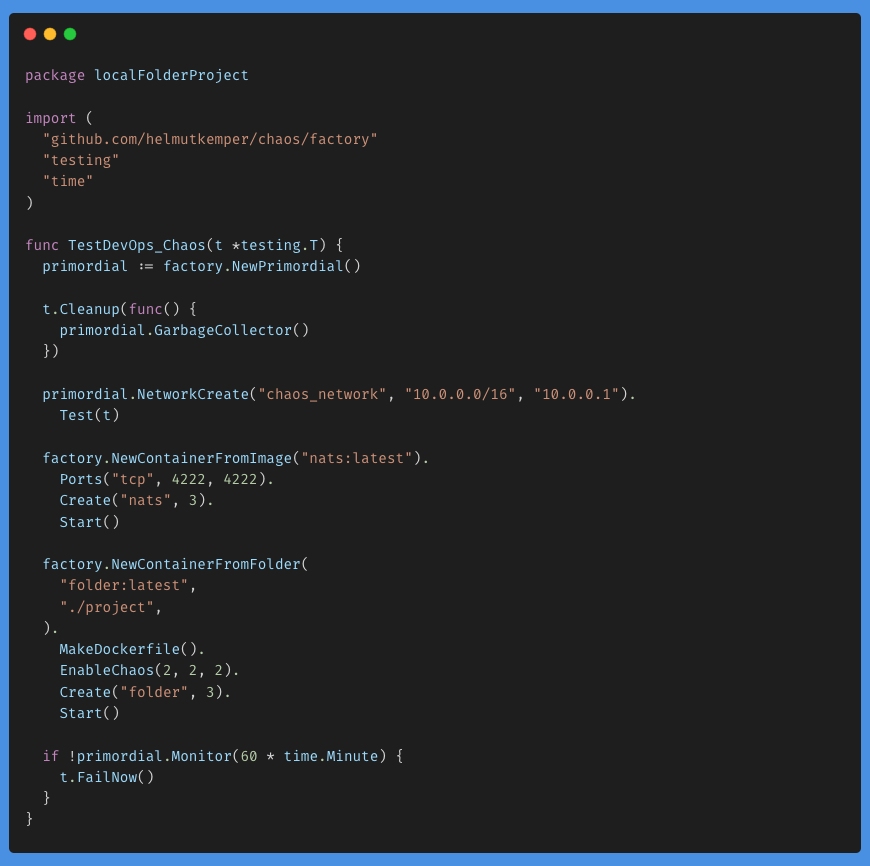
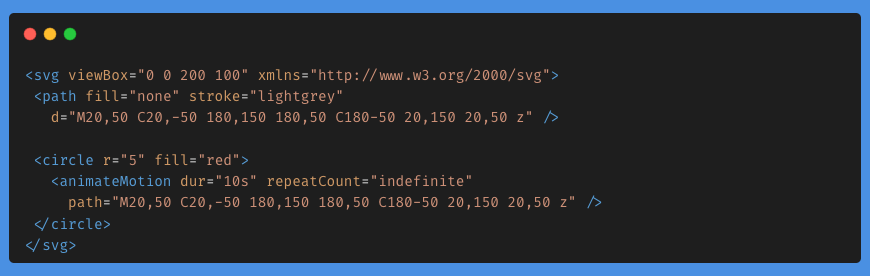
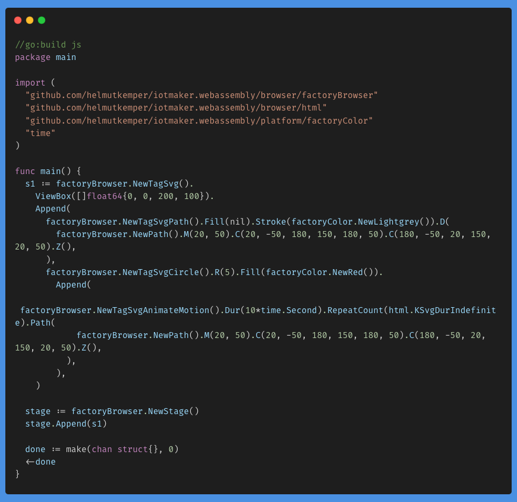
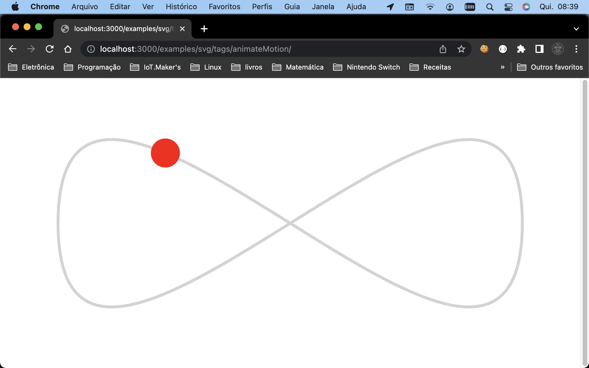

# Helmut Kemper

I am [**Helmut Kemper**](https://www.linkedin.com/in/helmut-kemper-93a5441b/) and I am a developer with about 6 years of experience in Golang and more than 20 years of professional experience.

I started programming in assembly of the [80C51, Intel](https://www.nxp.com/docs/en/data-sheet/8XC51_8XC52.pdf) microcontroller back in the late 1990s and fell in love with hardware. Then life took me to [PHP](https://www.php.net/), [MongoDB](https://www.mongodb.com/), [Open Street Maps](https://www.openstreetmap.org/), [Docker](https://www.docker.com/), [gRPC](https://grpc.io/) and a host of other technologies.

## Microservices

[Failure microservice test](https://github.com/helmutkemper/chaos), a way to avoid the famous phrase, "on my computer it works".

Run all the necessary infrastructure for your microservice to work, as simple test, and see how it behaves when the infrastructure fails randomly.

## Webassembly

[A framework](https://github.com/helmutkemper/webassembly) made to allow running golang code at almost 80% of the speed of a native app in the browser, without the need for installers.

There are already more than 200 examples!

HTML code, much slower.

Golang code, running as a binary. Almost 80% of the speed of a native app in a simple browser.

#### **C** is life! **Golang** is an evolution of **C**!

